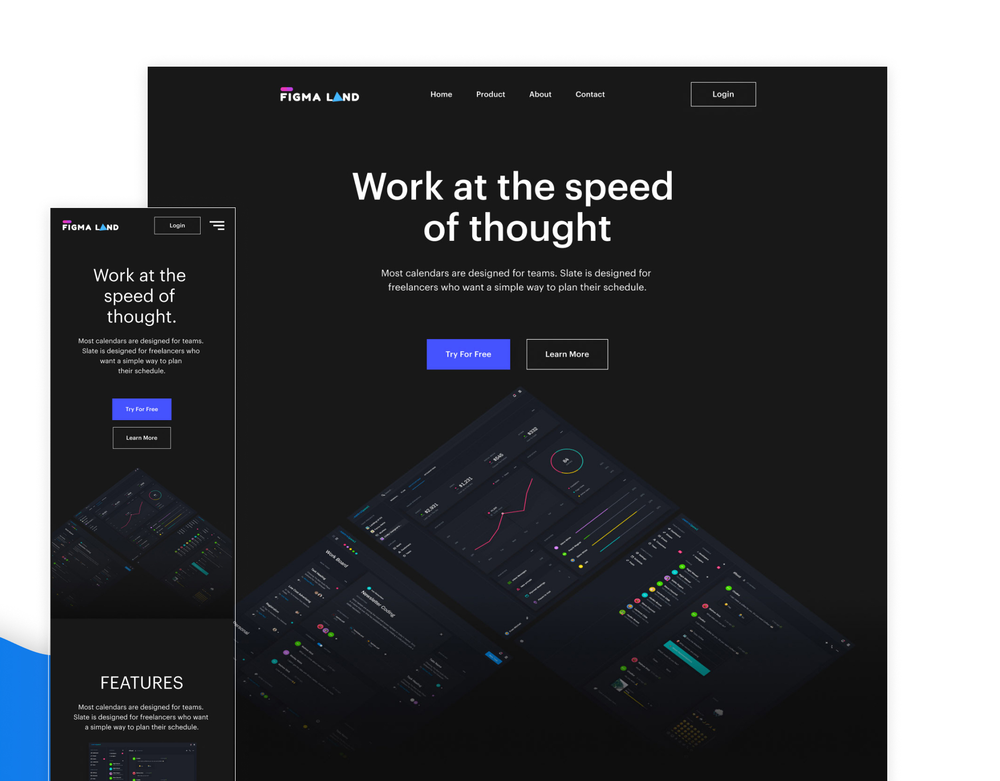

<h1 align="center">
    
</h1>

 

    <a href="#tecnologias">Tecnologias</a>&nbsp;&nbsp;&nbsp;|&nbsp;&nbsp;&nbsp;
  <a href="#sobre">Sobre</a>&nbsp;&nbsp;&nbsp;|&nbsp;&nbsp;&nbsp;
  <a href="#começando">Começando</a>&nbsp;&nbsp;&nbsp;|&nbsp;&nbsp;&nbsp;
  <a href="#layout">Layout</a>&nbsp;&nbsp;&nbsp;|&nbsp;&nbsp;&nbsp;
  <a href="#license">License</a>

 

  
  
       

  

 

 

# 🤖 Tecnologias

As tecnologias usadas neste app foram:

* React
* Styled-components

 

# 💻 Sobre

Este projeto foi desenvolvido a partir de um projeto de landing page no Figma, onde só foi feito a parte visual da mesma com intuito de reforçar estudos e uma maior familiaridade com componentização e estilização no React.

 

# 🚀 Começando

Este projeto foi criado a partir do [Create React App](https://github.com/facebook/create-react-app).

## Scripts Disponíveis

Neste projeto,você poderá rodar com:

### `yarn start`

Abra este app no modo de desenvolvimento.\
Abra o [http://localhost:3000](http://localhost:3000) para abrir no seu browser.

A página irá recarregar assim que você fizer edições.\
Você também poderá ver os erros no console.

 

# 🖼️ Layout

O layout foi desenvolvido por http://figmaland.com, para termos mais acessos aos seus detalhes, podemos encontrar seus detalhes dentro do Figma atráves deste [link](https://www.figma.com/file/oAlu4ZVtL6lm6a8OL5532F/Figma-startup-landing-page-dark-(Community)?node-id=96%3A181).

 

# 📝 Lincese

Este projeto está sobre a licença da MIT, caso queira saber mais detalhes, clique neste [link](https://github.com/CrysLef/Figmaland/blob/main/LICENSE).

 

-----

Feito com 💙 por [Crystian](https://www.linkedin.com/in/crystian-lefundes/) !
